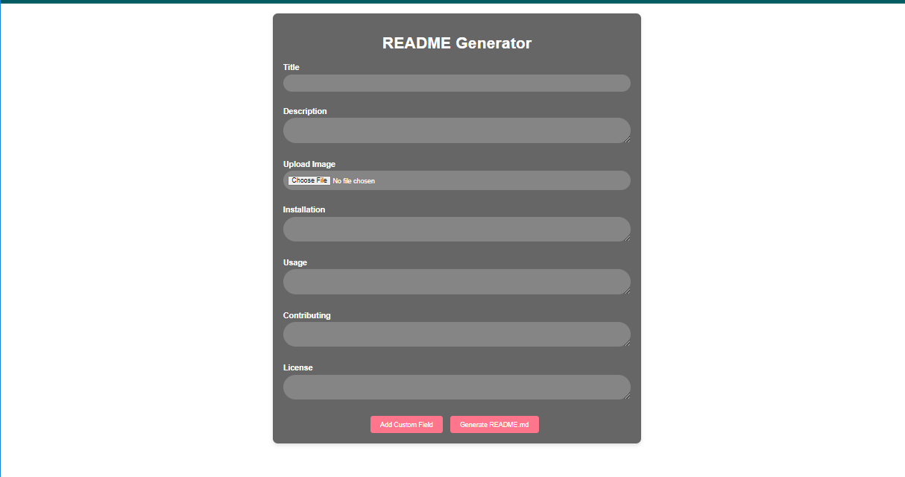
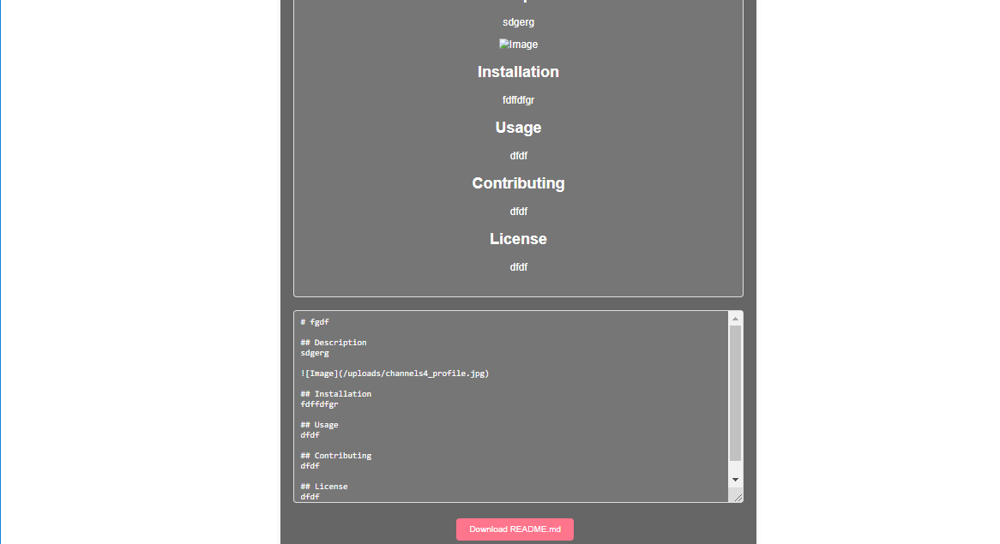

# README.md Generator

A web application to generate a `README.md` file for your projects using Python and Flask.



## Features

- User-friendly interface to input project details
- Generates a structured and well-formatted `README.md` file
- Download the generated `README.md` file

## Technologies Used

- Python
- Flask
- HTML/CSS/JavaScript
- HTMX for AJAX requests

## Requirements

- Python 3.x
- Flask

## Installation

1. Clone the repository:
    ```bash
    
    git clone https://github.com/ZaynZain/README.md-Generator.git
    cd readme-generator
    ```

2. Create a virtual environment:
    ```bash
    python3 -m venv venv
    source venv/bin/activate  # On Windows use `venv\Scripts\activate`
    ```

3. Install the required packages:
    ```bash
    pip install -r requirements.txt
    ```

## Usage

1. Run the Flask application:
    ```bash
    flask run
    ```

2. Open your web browser and navigate to:
    ```
    http://127.0.0.1:5000
    ```

3. Fill in the project details in the form and submit.

4. Download the generated `README.md` file.



## Roadmap

1. **Set up the project in your IDE:**
    - Open the project folder in your favorite IDE (e.g., VSCode, PyCharm).
    - Ensure the virtual environment is activated.

2. **Run the application:**
    - Use the terminal in your IDE to run the Flask application (`flask run`).
    - Open the provided URL in your browser to access the application.

3. **Development:**
    - To add new features or modify existing ones, edit the Python and HTML files in the project directory.
    - Save changes and restart the Flask application to see updates.

## Contributing

1. Fork the repository.
2. Create a new branch (`git checkout -b feature-branch`).
3. Make your changes.
4. Commit your changes (`git commit -m 'Add some feature'`).
5. Push to the branch (`git push origin feature-branch`).
6. Open a Pull Request.

## License

This project is licensed under the MIT License - see the [LICENSE](LICENSE) file for details.
